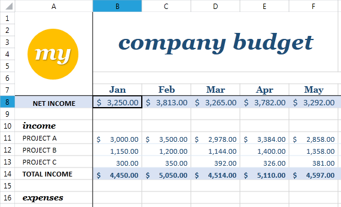
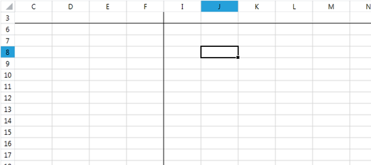

# Freeze Panes

This article briefly describes what frozen panes are, and how to create and work with them.  It contains the following sections:

* [What are frozen panes?](#what-are-frozen-panes)

* [Types of panes](#types-of-panes)

* [What defines the panes positioning?](#what-defines-the-panes-positioning)

* [Freezing panes](#freezing-panes)

* [Unfreezing panes](#unfreezing-panes)

## What are Frozen Panes?

Frozen panes are a method to keep part of the worksheet visible at all times when scrolling. 
   
#### Figure 1: A document with frozen top rows and first left column

## Types of Panes

Panes have the following properties:
        

There are four types of panes, as marked on the image below:

1.	Fixed
2.	Horizontal scrollable
3.	Vertical scrollable
4.	Scrollable

#### Figure 2: Types of panes
             

When the panes are split only horizontally the panes present are horizontal scrollable and scrollable. When the panes are split vertically, the two panes are vertical scrollable and scrollable.

## What Defines the Panes Positioning?

In order to describe fully the state of the frozen panes, the following need to be specified:

* __Top left cell index of the fixed pane__: This property determines the position to which the viewport is scrolled. When this is different from A1, any areas above and to the left of the index become unreachable. In __Figure 3__ this is C3.

* __Frozen rows count__: The number of visible rows contained by the horizontal scrollable pane. In __Figure 3__ this value is 1

* __Frozen columns count__: The number of visible columns contained by the vertical scrollable pane. In __Figure 3__ this value is 4.

* __Top left cell index of the scrollable pane__: This property determines the scroll position of the scrollable pane. In __Figure 3__ this is I6. Note that this index is different from the topmost and leftmost point of the scrollable pane.

#### Figure 3: Panes positioning
 
    

## Freezing Panes
### FreezePanes Methods

Panes can be frozen through the ViewState property of the Worksheet. It is of type WorksheetViewState and exposes the following overloads of the FreezePanes method:

* void FreezePanes(int frozenRowsCount, int frozenColumnsCount)
* void FreezePanes(CellIndex fixedPaneTopLeftCellIndex, int frozenRowsCount, int frozenColumnsCount)
* void FreezePanes(CellIndex fixedPaneTopLeftCellIndex, int frozenRowsCount, int frozenColumnsCount, CellIndex scrollableTopLeftCellIndex)

If the top left cell indices of the fixed pane and of the scrollable pane are not specified, it will be assumed that the top left index of the fixed pane is the current top left index of the viewport and that the scrollable pane is not scrolled.

The result illustrated in __Figure 3__ can be achieved with the code from __Example 1__.

#### __[C#] Example 1: Freezing panes__
{{region radspreadprocessing-features-freeze-panes_01}}
    CellIndex fixedPaneTopLeftCellIndex = new CellIndex(2, 2);
	CellIndex scrollableTopLeftCellIndex = new CellIndex(5, 8);
	workbook.ActiveWorksheet.ViewState.FreezePanes(fixedPaneTopLeftCellIndex, 1, 4, scrollableTopLeftCellIndex);
{{endregion}}

### Horizontal and Vertical Split

If you would like to create a vertical or horizontal split, all you need to do is specify either the row count or the column count to be equal to zero.

#### __[C#] Example 2: Vertical split__
{{region radspreadprocessing-features-freeze-panes_02}}
	CellIndex fixedPaneTopLeftCellIndex = new CellIndex(2, 2);
	workbook.ActiveWorksheet.ViewState.FreezePanes(fixedPaneTopLeftCellIndex, 0, 4);
{{endregion}}

The result from __Example 2__ is shown on __Figure 4__.

#### Figure 4: Vertical split
 

Since the two panes present are only vertical scrollable and scrollable the columns A and B will remain unreachable. However, the user will be able to scroll to the first two rows. Even though there are two rows from the start of the document at the time of freezing, the document will not be split horizontally.

### The Pane Class

Another option to freeze the panes in a worksheet is to use the Pane property of type Pane of the WorksheetViewState. The functionality you can achieve is almost identical to the FreezePanes() methods. The Pane class has the following properties:

* __TopLeftCellIndex__: The top left cell index of the scrollable pane

* __XSplit__: The number of visible columns contained by the vertical scrollable pane

* __YSplit__: The number of visible rows contained by the horizontal scrollable pane.

* __ActivePane__: The current active pane.

* __State__: The state of the frozen panes. At the moment only the Frozen state is supported.

The state from __Figure 3__ can be achieved with the code from __Example 3__.

#### __[C#] Example 3: Freeze panes through the Pane class__
{{region radspreadprocessing-features-freeze-panes_03}}
	CellIndex scrollableTopLeftCellIndex = new CellIndex(5, 8);
	Pane pane = new Pane(scrollableTopLeftCellIndex, 4, 1, ViewportPaneType.Scrollable);
	workbook.ActiveWorksheet.ViewState.Pane = pane;
{{endregion}}

> Regardless of the method used to freeze the panes of a worksheet, you should take care not to place the top left index of the frozen pane below or to the right of the index determined by the frozen row count and the frozen column count. Doing so may result in an invalid document and unexpected behavior.

## Unfreezing Panes

In order to unfreeze the panes of the worksheet, you need to use the same methods as above but specify zero for number of frozen rows and columns.

#### __[C#] Example 4: Unfreezing panes__
{{region radspreadprocessing-features-freeze-panes_04}}
	workbook.ActiveWorksheet.ViewState.FreezePanes(0, 0);
{{endregion}}

Another option is to set the Pane property of the ViewState to null.

#### __[C#] Example 4: Unfreezing panes through the Pane class__
{{region radspreadprocessing-features-freeze-panes_05}}
	workbook.ActiveWorksheet.ViewState.Pane = null;
{{endregion}}

# See Also

 * [What is a Worksheet?]()