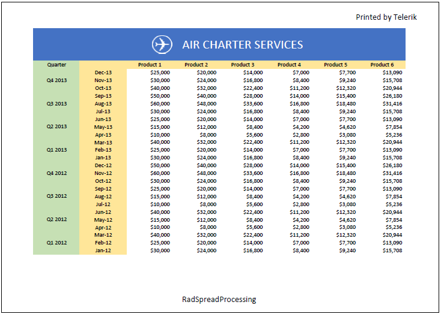
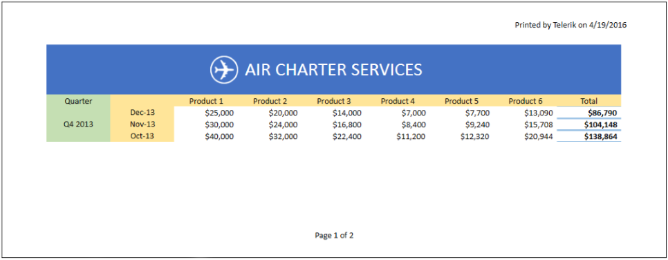

# Headers and Footers

Headers and Footers functionality allows you add rich text content in the page margins when exporting a worksheet to pages. This feature is useful in scenarios like [exporting to PDF](), [printing with RadSpreadsheet control](http://docs.telerik.com/devtools/wpf/controls/radspreadsheet/features/ui-printing) or import/export to XLSX. 

This article aims to present the Headers and Footers API in **RadSpreadprocessing**. It contains the following subsections:

* [HeaderFooterSettings](#headerfootersettings)

* [HeaderFooterContent](#headerfootercontent)

* [HeaderFooterSection](#headerfootersection)

* [Header/Footer Escaping Sequences and Fields](#headerfooter-escaping-sequences-and-fields)

* [Header/Footer Margins](#headerfooter-margins)

## HeaderFooterSettings

**HeaderFooterSettings** is the class that defines how the headers and footers of some worksheet should look like. An instance of this class can be obtained through the propertied of [WorksheetPageSetup](#worksheetpagesetup-properties). 

#### **[C#] Example 1: Get HeaderFooterSettings**
{{region cs-radspreadprocessing-features-headers-and-footers_0}}

	HeaderFooterSettings settings = worksheet.WorksheetPageSetup.HeaderFooterSettings;
{{endregion}}

**HeaderFooterSettings** class has the following properties:

* **DifferentOddAndEvenPages**: A *boolean* value, indicating whether there should be different headers and footers for the odd and for the even pages.

* **DifferentFirstPage**: A *boolean* value, indicating whether there should be different header and footer on the first page.

* **ScaleWithDocument**: A *boolean* value, indicating whether headers and footers should be scaled using the **ScaleFactor** property of [WorksheetPageSetup]() when being rendered. When ScaleWithDocument is set to *false*, then headers and footers are always rendered at 100% scale.

* **AlignWithPageMargins**: A *boolean* value, indicating whether headers and footers should align with the left and right margins according to the value of the **Margins** property of [WorksheetPageSetup](). When AlignWithPageMargins value is set to *false*, headers and footers are aligned with the left and right margins according to the value of the **NormalMargins** static property of [PageMargins](docs.telerik.com/devtools/document-processing/api/html/T_Telerik_Windows_Documents_Spreadsheet_Model_Printing_PageMargins.htm). 

* **Header**: Represents the default header content. When DifferentOddAndEvenPages is set to *true* then Header property represents the header content of the *odd* pages only. The property is of type [HeaderFooterContent](#headerfootercontent).

* **Footer**: Represents the default footer content. When DifferentOddAndEvenPages is set to *true* then Footer property represents the footer content of the *odd* pages only. The property is of type [HeaderFooterContent](#headerfootercontent).

* **FirstPageHeader**: Represents the header content of the first page. This content is used only when DifferentFirstPage property is set to *true*. The property is of type [HeaderFooterContent](#headerfootercontent).

* **FirstPageFooter**: Represents the footer content of the first page. This content is used only when DifferentFirstPage property is set to *true*. The property is of type [HeaderFooterContent](#headerfootercontent).

* **EvenPageHeader**: Represents the header content of the even pages. This content is used only when DifferentOddAndEvenPages property is set to *true*. The property is of type [HeaderFooterContent](#headerfootercontent).

* **EvenPageFooter**: Represents the footer content of the even pages. This content is used only when DifferentOddAndEvenPages property is set to *true*. The property is of type [HeaderFooterContent](#headerfootercontent).

## HeaderFooterContent

The **HeaderFooterContent** class defines the content of a header or a footer. This class exposes the following properties:

* **LeftSection**: Represents the content of the left header/footer section. The content of this section is flowing from the left  to the right page margin with left horizontal alignment. The property is of type [HeaderFooterSection](#headerfootersection).

* **CenterSection**: Represents the content of the center header/footer section. The content of this section is flowing from the left to the right page margin with horizontal alignment center. The property is of type [HeaderFooterSection](#headerfootersection).

* **RightSection**: Represents the content of the right header/footer section. The content of this section is flowing from the left to the right page margin with right horizontal alignment. The property is of type [HeaderFooterSection](#headerfootersection).

* **HasValidLength**: A *boolean* value, indicating whether the length of the header/footer content is valid. There is a limitation in the amount of text, which can be inserted in the three sections of the header/footer content. When the value of HasValidLength is *false*, this indicates that the total length from the three sections exceeds the limitation. In this case, some of the header/footer content will be trimmed when exporting to XLSX and PDF or when printing the worksheet.

## HeaderFooterSection

The **HeaderFooterSection** class defines the content of a particular header/footer section. Using the Text property, you can set a string that defines the content in the section. Within the text content you may use special escaped sequences that allow you achieve rich text content and insert fields that are going to be evaluated when creating the Worksheet pages. 

**Example 2** shows how to set a sample content to header and footer sections. The code demonstrates how to insert a “*Date*” field in the right section of the header and a “*Page*” and a “*Number of pages*” fields in the center section of the footer.

#### **[C#] Example 2: Set a content to a header/footer section**

{{region cs-radspreadprocessing-features-headers-and-footers_1}}

	HeaderFooterSettings settings = worksheet.WorksheetPageSetup.HeaderFooterSettings;
	settings.Header.RightSection.Text = "Printed by Telerik";
	settings.Footer.CenterSection.Text = "RadSpreadProcessing";
{{endregion}}

The header and footer of the first page in the worksheet from the snippet above will be evaluated and rendered as shown in **Figure 1**.

#### **Figure 1: Text in header and footer of a spreadsheet document**

## Header/Footer Escaping Sequences and Fields

The ampersand symbol (‘&’) has a special meaning in the context of headers and footers section text. Depending on what follows after this symbol, the text formatting may be changed or some special field may be inserted. 

The following list describes all valid uses of the ampersand symbol sequences. If none of the below cases is fulfilled, then the ampersand symbol is skipped. 

* **&&**: This text sequence is evaluated as a **single ampersand symbol**. This way, the ampersand is escaped and inserted in header/footer section.

* **&B**: This text sequence changes the **bold** state. The text right after this sequence will have a different FontWeight compared to the text just before it.

* **&I**: This text sequence changes the **italic** state. The text right after this sequence will have a different FontStyle compared to the text just before it.

* **&U**: This text sequence changes the **underline** state. If the text before this sequence has applied an underline pattern different than *single*, then the text after it will be single underlined. Otherwise, the text after the sequence will not be underlined.

* **&E**: This text sequence changes the underline state. If the text before this sequence has applied an underline pattern different than *double underline*, then the text after it will be double underlined. Otherwise, the text after the sequence will not be underlined. Note that double underline is currently supported only in xlsx import/export and not supported in PDF export.

* **&S**: This text sequence changes the **strikethrough** state. Note that strikethrough is supported in XLSX import/export, but it is not supported in PDF export.

* **&Y**: This text sequence changes the **baseline alignment** state. If the text right before this sequence has a baseline alignment different than *subscript*, then the text right after it will be *subscript*. Otherwise, the text after the sequence will have the default baseline alignment. 

* **&X**: This text sequence changes the **baseline alignment** state. If the text right before this sequence has a baseline alignment different than *superscript*, then the text right after it will be *superscript*. Otherwise the text after the sequence will have the default baseline alignment. 

* **&”&lt;FontFamily&gt;,&lt;FontStyle&gt;”**: This text sequence allow you to change the **font family** and the **font style**. The new font definition is surrounded by quotation marks and the font family is separated from the font style by a single comma. In place of &lt;FontFamily&gt; there should be the font family name or a single dash (‘-‘) in case you want to use the Normal font family from the Workbook’s theme. In place of &lt;FontStyle&gt; there should be one of the following – “Regular”, “Bold”, “Italic” and “Bold Italic”. For example, if you want to set the normal font family with regular FontWeight and FontStyle, you may use the following text sequence – &”-,Regular”. If you want to show text with Arial font family that is bold and italic you should use the following text sequence - &”Arial,Bold Italic”.

* **&K&lt;ColorValue&gt;**: This text sequence allows you to change the **color of the text**. In place of &lt;ColorValue&gt; you should place a text with length 6 that represents the color value. The color value may be a hex string that defines the RGB values. For example, if you want to show red text, you may use the following sequence - &KFF0000. The color value may also be set as a ThemableColor with tint and shade. For example, if you want to set ThemableColor with ThemeColorType value of 5 and tint and shade value of +0.39, you should use the following sequence - &K05+039.

* **&&lt;FontSize&gt;**: This text sequence allows you to change the **font size** of the text. In place of &lt;FontSize&gt; there should be an integer number representing the font size in Points. For example, if you want to show text with font size 14pt, then you should use the following code sequence - &14.

* **&P**: This text sequence allows you to insert a **page number** field. This field is evaluated for each page and is rendered as the current page number value.

* **&N**: This text sequence allows you to insert a **number of pages** field. This field is evaluated and displayed as the total number of pages.

* **&D**: This text sequence allows you to insert a **date** field. This field is evaluated as the date on which the printing or PDF export has started.

* **&T**: This text sequence allows you to insert a **time** field. This field is evaluated as the time when the printing or PDF export has started.

* **&Z**: This text sequence allows you to insert the **file folder** field. This field is evaluated as the full folder path to the currently opened file. Note that when exporting a Workbook, this field is evaluated as empty string because the Workbook instance is not related to any concrete file in the file system.

* **&F**: This text sequence allows you to insert a **Workbook name** field. This field is evaluated as the Workbook Name property value.

* **&A**: This text sequence allows you to insert a **Sheet name** field. This field is evaluated as the Sheet Name property value.

**Example 3** demonstrates how you could insert a date field in the header, a page number filed combined with а number of pages field in the footer of a worksheet .

#### **[C#] Example 3: Insert fields in header/footer**

{{region cs-radspreadprocessing-features-headers-and-footers_2}}

	HeaderFooterSettings settings = worksheet.WorksheetPageSetup.HeaderFooterSettings;
	settings.Header.RightSection.Text = "Printed by Telerik on &D";
	settings.Footer.CenterSection.Text = "Page &P of &N";
{{endregion}}

**Figure 2** shows how the document will look like after applying the settings demonstrated in **Example 3**.

#### **Figure 2: Evaluated fields in header and footer**

## Header/Footer Margins

In order to control the vertical positioning of the headers and footers on the page, you can use the **Margins** property of [WorksheetPageSetup](). Within the [PageMargins class](docs.telerik.com/devtools/document-processing/api/html/T_Telerik_Windows_Documents_Spreadsheet_Model_Printing_PageMargins.htm), there are two properties that define headers and footers positioning:

* **Header**: This margin defines the distance between the Header and the top page side. The default value is 0.3 inches.

* **Footer**: This margin defines the distance between the Footer and the bottom page side. The default value is 0.3 inches.

**Example 4** shows how you could set the margins of a worksheet using the predefined NormalMargins of PageMargins for the page margins, 0 inches for the footer margin and 1 inch for the header.

#### **[C#] Example 4: Setting margins to header/footer**

{{region cs-radspreadprocessing-features-headers-and-footers_3}}
	PageMargins normalMargins = PageMargins.NormalMargins;
	worksheet.WorksheetPageSetup.Margins = new PageMargins(normalMargins.Left, normalMargins.Top, normalMargins.Right, normalMargins.Bottom, Unit.DipToInch(0), Unit.DipToInch(1));
{{endregion}}

The [Unit class](http://docs.telerik.com/devtools/document-processing/api/html/T_Telerik_Windows_Documents_Media_Unit.htm), used in **Example 4** provides convenient methods that can help you convert a value between different measurement units.

# See Also

* [Worksheets]()

* [WorksheetPageSetup]()