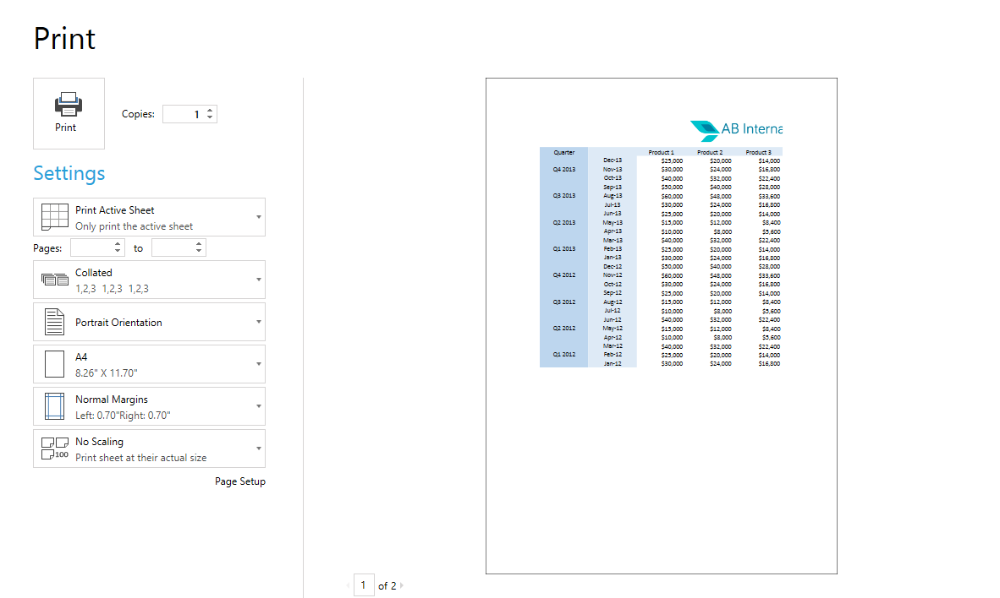
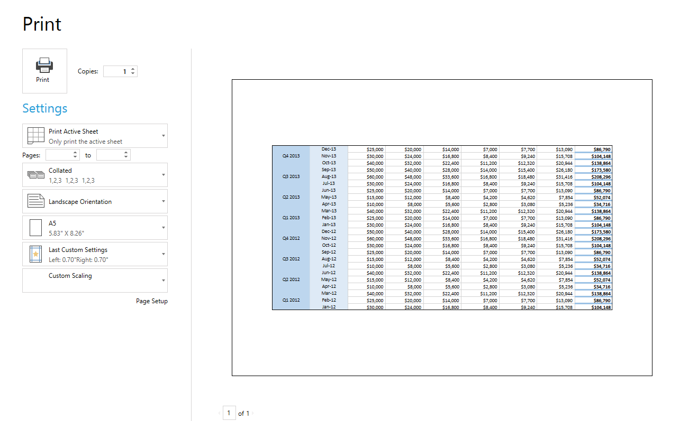

# Worksheet Page Setup

There are cases, such as printing or exporting scenarios, when you need to present the __Worksheet__'s content on a set of pages. In these cases, particularly handy comes the __WorksheetPageSetup__ class which provides you with the needed properties for controlling how the content is split and presented into pages.
      

This article aims to present the WorksheetPageSetup API and demonstrate how to use it. It contains the following sections:
      

* [WorksheetPageSetup Properties](#worksheetpagesetup-properties)

* [Using Print Area](#using-print-area)

* [Using Page Breaks](#using-page-breaks)

## WorksheetPageSetup Properties

Through the Worksheet's __WorksheetPageSetup__ property you may change the following worksheet's page setup properties:
        

* __PaperType__: Specify paper type using the [PaperType](http://www.telerik.com/help/wpf/t_telerik_windows_documents_model_papertypes.html) enumeration.
            

* __PageOrientation__: Specify whether the page orientation should be Portrait or Landscape.
            

* __Margins__: Specify the sizes of the page margins.
            

* __PageOrder__: Specify whether the page order should be "Down, then over" or "Over, then down".
            

* __CenterHorizontally__: Specify whether the print content should be centered horizontally within the area between the page margins.
            

* __CenterVertically__: Specify whether the print content should be centered vertically within the area between the page margins.
            

* __ScaleFactor__: Specify the scale factor to print with value in the range from 50% to 400%.
            

* __PrintOptions__: Specify print options such as whether to print gridlines or row and column headings.
            

* __PrintArea__: Change the print area in the selected worksheet.
            

* __PageBreaks__: Change the page breaks collection in the selected worksheet.
            

__Figures 1 and 2__ show an example of Worksheet's page setup usage. In the example, we have spreadsheet data that has bigger width than height. Previewing the print pages with the default settings we can see that it doesn't fit well as the print content is split into two pages.
        

#### Figure 1: Initial print preview of data

In order to fit the print content better, we use the Worksheet's page setup and change page orientation as well as the scale factor and some additional print settings. __Example 1__ shows the code that needs to be executed.
        

#### __[C#] Example 1: Use WorksheetPageSetup__

{{region radspreadprocessing-features-worksheetpagesetup_0}}
    WorksheetPageSetup pageSetup = workbook.ActiveWorksheet.WorksheetPageSetup;

    pageSetup.PaperType = PaperTypes.A4;
    pageSetup.PageOrientation = PageOrientation.Landscape;
    pageSetup.ScaleFactor = new Size(0.9, 0.9);
    pageSetup.CenterHorizontally = true;
{{endregion}}

As a result, we managed to fit the data into a single page with size A4 as shown in __Figure 2__.
        

#### Figure 2: Result after page setup

## Using Print Area

When printing a worksheet, by default the whole used cell range is used for printing. If you do not need to print the whole  content of the worksheet, you can set a print area by specifying a list of ranges to print.
        

Through WorksheetPageSetup's __PrintArea__ property you can access the print area of a worksheet and change its print ranges with the following methods:
        

* __SetPrintArea()__: Sets the print area ranges using some given set of CellRange instances. This method clears all previously set ranges.
            

* __CanAddToPrintArea()__: Returns a Boolean indicating whether the passed set of print ranges can be added in the existing print area. If some of the given ranges intersects with an already existing print area range, the result is false.
            

* __TryAddToPrintArea()__: Tries to add some given set of CellRange instances to the collection of areas and returns a Boolean indicating the success of this operation.
            

* __Clear()__: Clears the existing print area ranges.
            

The example shown in __Figure 3__ demonstrates how to use Worksheet's print area. In this example, we have a big table with data and we want to print only two specific ranges. To achieve that, the print area is set with these cell ranges in the code snippet from __Example 2__.
        

#### __[C#] Example 2: Set PrintArea__

{{region radspreadprocessing-features-worksheetpagesetup_1}}
    PrintArea printArea = workbook.ActiveWorksheet.WorksheetPageSetup.PrintArea;

    printArea.SetPrintArea(new CellRange[]
    {
        new CellRange(0, 0, 4, 8),
        new CellRange(1, 1, 25, 3)
    });
{{endregion}}

#### Figure 3: Resulting PrintArea preview

## Using Page Breaks

When a big cell range cannot fit into a single page it gets split into multiple pages. If you need your pages to be split in some concrete places, you can specify these places by inserting a PageBreak.
        

Through WorksheetPageSetup's __PageBreaks__ property you can manipulate the page breaks collection of a worksheet using the following methods:
        

* __TryInsertHorizontalPageBreak()__: Tries to insert a horizontal page break at some specific index. Returns true when a page break is inserted.
            

* __TryInsertHorizontalPageBreak()__: Tries to insert a horizontal page break at some specific index. Returns true when a page break is inserted.
            

* __TryInsertVerticalPageBreak()__: Tries to insert a vertical page break at some specific index. Returns true when a page break is inserted.
            

* __TryRemoveHorizontalPageBreak()__: Tries to remove a horizontal page break at some specific index. Returns true when a page break is removed.
            

* __TryRemoveVerticalPageBreak()__: Tries to remove a vertical page break at some specific index. Returns true when a page break is removed.
            

* __TryInsertPageBreaks()__: Tries to insert horizontal and vertical page break at some specific index. Returns true when at least one page break is inserted.
            

* __TryRemovePageBreaks()__: Tries to remove horizontal and vertical page break at some specific index. Returns true when at least one page break is removed.
            

* __Clear()__: Clears all existing page breaks from the page breaks collection.
            

__Figure 4__ shows a preview of large amount of data.
        

#### Figure 4: Initial preview of data

In order to separate semantically-correct the print data onto several pages, we are going to place horizontal page breaks at the place where we need the splitting to happen. __Example 3__ shows how this can be achieved.
        

#### __[C#] Example 3: Insert PageBreaks__

{{region radspreadprocessing-features-worksheetpagesetup_2}}
    PageBreaks pageBreaks = workbook.ActiveWorksheet.WorksheetPageSetup.PageBreaks;

    pageBreaks.TryInsertHorizontalPageBreak(5, 0);
    pageBreaks.TryInsertHorizontalPageBreak(8, 0);
    pageBreaks.TryInsertHorizontalPageBreak(11, 0);
    pageBreaks.TryInsertHorizontalPageBreak(14, 0);
    pageBreaks.TryInsertHorizontalPageBreak(17, 0);
    pageBreaks.TryInsertHorizontalPageBreak(20, 0);
    pageBreaks.TryInsertHorizontalPageBreak(23, 0);
{{endregion}}

As a result of inserting these horizontal page breaks we have eight pages to print. The first one is shown in __Figure 5__.
        

#### Figure 5: Result of PageBreaks

