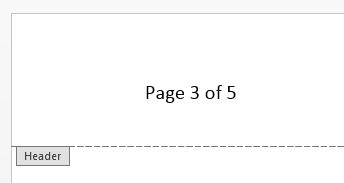
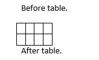

# RadFlowDocumentEditor

Although __RadFlowDocument__ can be created and modified by using the style properties and child collections of the document elements, this can be quite cumbersome. __RadFlowDocumentEditor__ is intended to simplify this process and achieve the same results with less amount of code. It is also useful when a couple of document elements should be inserted in the right order to ensure the document integrity – for example, when inserting fields, hyperlinks, images etc.
      

* [Creating and Positioning](#creating-and-positioning)

* [Inserting Document Elements](#inserting-document-elements)

* [Changing Current Styles](#changing-current-styles)

## Creating and Positioning

__RadFlowDocumentEditor__ is always associated with a single document, which it takes as a constructor parameter when it is created.
        

#### __[C#] Example 1: Create a RadFlowDocumentEditor__

{{region cs-radwordsprocessing-editing-radflowdocumenteditor_0}}
	RadFlowDocument document = this.CreateDocument();
	RadFlowDocumentEditor editor = new RadFlowDocumentEditor(document);
{{endregion}}

The editor maintains an internal position inside the document. This position points either inside a paragraph (to an inline) or directly after the end of a table element. Here is a list of the available methods for changing the position of the editor within a document:
        
* **MoveToInlineStart(InlineBase inline)**

* **MoveToInlineEnd(InlineBase inline)**

* **MoveToParagraphStart(Paragraph paragraph)**

* **MoveToTableEnd(Table table)**

The code from __Example 2__ demonstrates how to position the editor after the second inline in the first paragraph of the document.
        

#### __[C#] Example 2: Changing the position of RadFlowDocumentEditor__

{{region cs-radwordsprocessing-editing-radflowdocumenteditor_2}}
	Paragraph firstParagraph = document.EnumerateChildrenOfType<Paragraph>().First();
	editor.MoveToInlineEnd(firstParagraph.Inlines[1]);
{{endregion}}

Note that it is possible to create a __RadFlowDocumentEditor__ for an empty document (one with no sections). In this case, a section and a paragraph are automatically created when you call an insert method. __Example 3__ creates a document with one section, containing one paragraph with the text "Hello word!".
        

#### __[C#] Example 3: Insert text in a document__

{{region cs-radwordsprocessing-editing-radflowdocumenteditor_3}}
	RadFlowDocumentEditor editor = new RadFlowDocumentEditor(new RadFlowDocument());
	editor.InsertText("Hello word!");
{{endregion}}

## Inserting Document Elements

Most of the insert methods of __RadFlowDocumentEditor__ return the newly inserted element. This way you can set some additional properties of the element if desired.
        

### Inserting Text

Inserting text [Runs]() can be done with the following methods:
            

* public Run InsertText(string text): Inserts a new __Run__ with the given text in the current paragraph.

* public Run InsertLine(string text): Inserts a new __Run__ with the given text in the current paragraph and starts a new paragraph.

Both methods return the newly inserted __Run__ element. If, however, there are new lines in the text parameter – a new paragraph is also inserted for each new line. In this case, the returned run is the last one that is inserted.

The code in __Example 4__ inserts a run containing a new line.
            

#### __[C#] Example 4: Insert a run with a new line__

{{region cs-radwordsprocessing-editing-radflowdocumenteditor_4}}
	editor.InsertText("First" + Environment.NewLine + "Second");
{{endregion}}

The result looks like __Figure 1__ shows.

#### Figure 1

>The current [CharacterFormatting](#changing-current-styles) and [ParagraphFormatting](#changing-current-styles) is applied for each Run and Paragraph that is created.
              

### Inserting Paragraph

You can start a new [Paragraph]() with the __InsertParagraph()__ method. The current __ParagraphFormatting__ is applied to the new paragraph and the paragraph is returned.
            

#### __[C#] Example 5: Insert a paragraph__

{{region cs-radwordsprocessing-editing-radflowdocumenteditor_5}}
	editor.InsertText("First paragraph");
	editor.InsertParagraph();
	editor.InsertText("Second paragraph");
{{endregion}}

__Figure 2__ shows how the result from __Example 5__ looks like.

#### Figure 2: The content inserted in Example 5

If you call __InsertParagraph()__ method while the editor is positioned in the middle of a paragraph all the inlines after the position are moved inside the new paragraph. The effect is the same as pressing Enter key while the cursor is in the middle of a paragraph in a text editor application.

### Inserting Sections

Inserting [Section]() elements can be achieved with the __InsertSection()__ method. A paragraph with the new section’s properties will be added and the new __Section__ element will be returned.

#### __[C#] Example 6: Insert a section__
{{region cs-radwordsprocessing-editing-radflowdocumenteditor_12}}
	editor.InsertSection();
{{endregion}}

>If you call the __InsertSection()__ method while the editor is positioned in a TableCell, the Table will be split at the current row. This means that if the table contains 3 rows, and the editor is positioned in a cell which is on the second row, the table will be split into two tables – one with one row, which will be added to the previous section and one with 2 rows (containing the TableCell where the editor position was). The later will be added to the newly inserted Section.

### Inserting Hyperlinks

__Hyperlinks__ in the __RadFlowDocument__ model are actually [Fields](), which means they have code and result parts separated by [FieldCharacter]() inlines. Inserting hyperlinks is simplified with __RadFlowDocumentEditor.InsertHyperlink()__  method:
            

public Hyperlink InsertHyperlink(string text, string uri, bool isAnchor, string toolTip)

It automatically applies "Hyperlink" built-in style to the inserted hyperlink if there is no explicitly set style in the __CharacterFormatting__ options of the editor.
            

#### __[C#] Example 7: Insert a hyperlink__

{{region cs-radwordsprocessing-editing-radflowdocumenteditor_6}}
	editor.InsertHyperlink("telerik", "http://www.telerik.com", false, "Telerik site");
{{endregion}}

#### Figure 3: Hyperlink

### Inserting Code Fields

Inserting fields can be done with the __InsertField()__ method, which accepts code and result fragments:
            

public Field InsertField(string code, string result)

__Example 8__ shows how to add page numbering in the header of a document:
            

#### __[C#] Example 8: Add page numbering in a header__

{{region cs-radwordsprocessing-editing-radflowdocumenteditor_7}}
	// Create header and move the editor
	Header header = document.Sections[0].Headers.Add();
	editor.MoveToParagraphStart(header.Blocks.AddParagraph());
	
	editor.InsertText("Page ");
	editor.InsertField("PAGE", "1");
	editor.InsertText(" of ");
	editor.InsertField("NUMPAGES", "1");
{{endregion}}

#### Figure 4: The page numbering inserted in Example 8            

Note that in this case the result is automatically updated when a document is opened in MS Word, because the page fields are in the header of the document.
            

>tipYou can find an extensive list of field codes in the Office Open XML standard documentation - [ECMA-376](http://www.ecma-international.org/publications/standards/Ecma-376.htm) 4th edition, December 2012, Chapter 17.16.6 Field Definitions.
              

### Inserting Images

__RadFlowDocumentEditor__ provides several methods for inserting [ImageInline]() and [FloatingImage](). All of them return the inserted image element, so that additional manipulations can be done with it.
            
* **InsertImageInline(ImageSource source, Size size)**

* **InsertImageInline(Stream stream, string extension, Size size)**

* **InsertFloatingImage(ImageSource source, Size size)**

* **InsertFloatingImage(Stream stream, string extension, Size size)**

__Example 9__ shows how an image can be inserted using a stream:
            

#### __[C#] Example 9: Insert an image from a Stream__

{{region cs-radwordsprocessing-editing-radflowdocumenteditor_9}}
	editor.InsertText("Image:");
	using (Stream stream = this.GetResourceStream("Telerik_logo.png"))
	{
	    editor.InsertImageInline(stream, "png", new Size(118, 28));
	}
{{endregion}}

#### Figure 5: The image inserted in Example 9            

### Inserting Tables

The following methods can be used to insert [Table]() in the document:
            

* public Table InsertTable(): Inserts an empty table in the document.
* public Table InsertTable(int rows, int columns): Inserts table with specified number of rows and columns.
            

>The formatting specified with the [TableFormatting](#changing-current-styles) property is applied to the inserted table. After the insert operation the editor is automatically placed directly __after__ the inserted table (not inside it).
              

Here is how to insert a table with the "TableGrid" built-in style:
            

#### __[C#] Example 10: Insert a table with a style__

{{region cs-radwordsprocessing-editing-radflowdocumenteditor_10}}
	document.StyleRepository.AddBuiltInStyle(BuiltInStyleNames.TableGridStyleId);
	editor.TableFormatting.StyleId = BuiltInStyleNames.TableGridStyleId;
	
	editor.InsertText("Before table.");
	editor.InsertTable(2, 4);
	editor.InsertText("After table.");
{{endregion}}

#### Figure 6: The table in the document

>tip The **DocumentElementImporter** class allows you to import a document element from one document into another. Please, check [this article]() for more information about this functionality.

## Changing Current Styles

When you use the insert methods of the __RadFlowDocumentEditor__ the editor creates different document elements. You can control the formatting of the newly created elements with the following properties:
        

* __CharacterFormatting__: This formatting is applied to all newly created __Run__ elements. When inserting hyperlinks the "Hyperlink" built-in style is applied to the resulting fragment only if no style is set in the __CharacterFormatting__.
            

* __ParagraphFormatting__: This formatting is applied to all newly created __Paragraph__ elements. This also includes paragraphs that are inserted through __InsertText()__ and __InsertLine()__ methods.
            

* __TableFormatting__: This formatting is applied to all newly created __Table__ elements.
            

Formatting options are most useful when inserting multiple elements that should have consistent styling. For example, the code  from __Example 13__ inserts multiple paragraphs with no spacing between them and with text (Runs) in "Consolas" font:
        

#### __[C#] Example 11: Insert content with specified styles__

{{region cs-radwordsprocessing-editing-radflowdocumenteditor_11}}
	// Set code block formatting
	var codeFont = new ThemableFontFamily(new FontFamily("Consolas"));
	editor.CharacterFormatting.FontFamily.LocalValue = codeFont;
	editor.ParagraphFormatting.SpacingAfter.LocalValue = 0;
	
	editor.InsertLine("static void Main(string[] args)");
	editor.InsertLine("{");
	editor.InsertLine("    Console.WriteLine(\"Hello World\");");
	editor.InsertLine("}");
{{endregion}}

#### Figure 7: The inserted in Example 11 content

## See Also

 * [RadFlowDocumentEditor API Reference](http://docs.telerik.com/devtools/document-processing/api/html/T_Telerik_Windows_Documents_Flow_Model_Editing_RadFlowDocumentEditor.htm)
 * [RadFlowDocument API Reference](http://docs.telerik.com/devtools/document-processing/api/html/T_Telerik_Windows_Documents_Flow_Model_RadFlowDocument.htm)
 * [Document model]()
